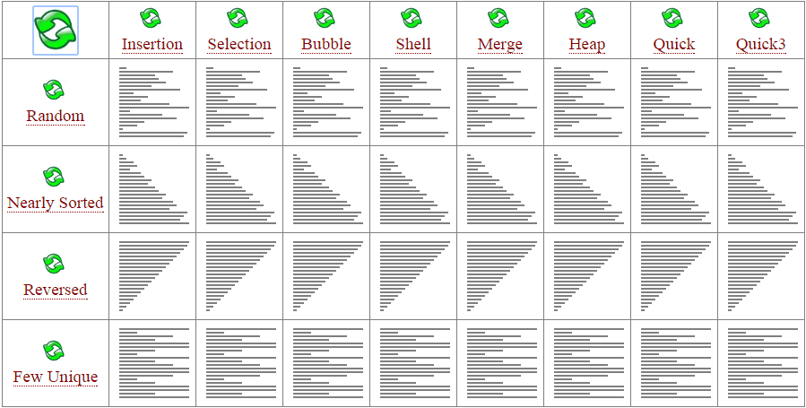
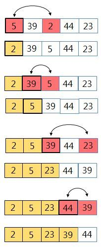

# Selection / Insert Sort 알고리즘



## 1. 선택 정렬 알고리즘(Selection Sort)

> 선택 정렬 알고리즘은 주변에서 손쉽게 접할 수 있는 정렬 알고리즘 중의 하나이다. 어떻게 선택 정렬 알고리즘이 실행되는지 살펴보도록 하자.



- 기본 개념은 데이터의 처음부터 끝까지 훑어가면서 가장 작은 값을 찾은 후에 그 값을 첫번째 데이터와 자리를 바꾸는 방법으로 구현되는 정렬 알고리즘이다.

```python
import random

def selected_sort(random_list):
    for i in range(len(random_list) - 1):
        min_idx = i
        for j in range(i + 1, len(random_list)):
            if random_list[j] < random_list[min_idx]:
                min_idx = j
        random_list[i], random_list[min_idx] = random_list[min_idx], random_list[i]

if __name__ == '__main__':
    list = []
    for i in range(10):
        list.append(random.randint(1, 10))
    print('<정렬 전>')
    print(list)
    selected_sort(list)
    print('<정렬 후>')
    print(list)
```

```
<정렬 전>
[9, 2, 4, 1, 1, 4, 2, 3, 5, 2]
<정렬 후>
[1, 1, 2, 2, 2, 3, 4, 4, 5, 9]
```

- 선택 정렬은 정렬된 값을 배열의 맨 앞부터 하나씩 채워나간다. 
- 따라서 뒤에 있는 index로 갈수록 비교 범위가 하나씩 줄어드는 특성을 가진다.
- 입력 배열이 이미 정렬되어 있건 말건 관계없이 동일한 연산량을 가지고 있기 때문에 최적화 여지가 적어서 성능이 떨어지는 편이다.

## 2. 삽입 정렬 알고리즘(Insert Sort)

> 선택 정렬 알고리즘이 정렬되지 않은 데이터 중에 가장 작은 값을 찾아서 정렬을 하는 방식이라면, **삽입 정렬은 그러한 작은 값을 찾는 검색 과정이 필요 없는 정렬 알고리즘**이다. **순차적으로 정렬하면서 현재의 값을 정렬되어 있는 값들과 비교하여 위치로 삽입**하는 방식이다.

```python
import random

def insertion_sort(random_list):
    for i in range(1, len(random_list)):
        for j in range(i, 0, -1):
            if random_list[j] < random_list[j - 1]:
                random_list[j], random_list[j - 1] = random_list[j - 1], random_list[j]

if __name__ == '__main__':
    list = []
    for i in range(10):
        list.append(random.randint(1, 10))
    print('<정렬 전>')
    print(list)
    insertion_sort(list)
    print('<정렬 후>')
    print(list)
```

```
<정렬 전>
[9, 9, 10, 6, 1, 10, 1, 4, 2, 5]
<정렬 후>
[1, 1, 2, 4, 5, 6, 9, 9, 10, 10]
```

