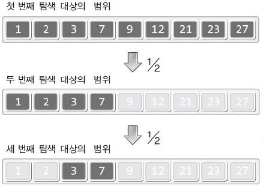

# 이진 검색 알고리즘(Binary Search Algorithm)

> 이진 검새 알고리즘은 순차 검색 알고리즘에 비해 **검색 시간을 좀 더 절약하는 방법**이다. 이진 검색은 어떤 방법으로 검색을 하는 알고리즘인지, 검색 시간은 얼마나 빠른지 알아보자

- 이진 검색 알고리즘을 **사용하기 위해서는 미리 정렬**을 해 두어야한다.

- 미리 **정렬되어 있는 데이터를 절반씩 잘라서 검색**하는 방법이다.



```python
import random

def quick_sort(arr):
    def sort(low, high):
        if high <= low:
            return

        mid = partition(low, high)
        sort(low, mid - 1)
        sort(mid, high)

    def partition(low, high):
        pivot = arr[(low + high) // 2]
        while low <= high:
            while arr[low] < pivot:
                low += 1
            while arr[high] > pivot:
                high -= 1
            if low <= high:
                arr[low], arr[high] = arr[high], arr[low]
                low, high = low + 1, high - 1
        return low

    return sort(0, len(arr) - 1)

def binary_search(random_list, wanted_data):
    first = 0
    last = len(random_list) - 1

    while first <= last:
        mid = (first + last) // 2

        if random_list[mid] == wanted_data:
            return mid
        elif random_list[mid] < wanted_data:
            first = mid + 1
        else :
            last = mid -1

    return None
        

if __name__ == '__main__':
    list = []
    for i in range(10):
        list.append(random.randint(1, 10))

    print('<정렬 전>')
    print(list)
    print('<정렬 후>')
    quick_sort(list)
    print(list)
    index = binary_search(list, 4)

    if index:
        print(list[index])
    else:
        print('찾는 숫자가 없어요')
```

```bash
# 찾는 숫자가 리스트에 없을 경우
<정렬 전>
[9, 5, 2, 9, 7, 2, 8, 8, 1, 5]
<정렬 후>
[1, 2, 2, 5, 5, 7, 8, 8, 9, 9]
찾는 숫자가 없어요

# 찾는 숫자가 리스트에 있을 경우
<정렬 전>
[7, 3, 10, 4, 3, 2, 4, 1, 4, 1]
<정렬 후>
[1, 1, 2, 3, 3, 4, 4, 4, 7, 10]
4
```

